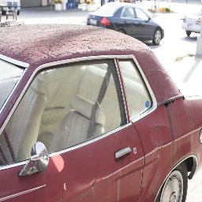
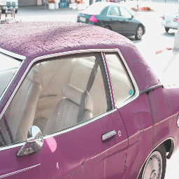
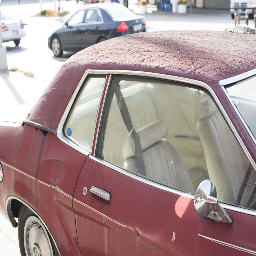

\newpage{}

# Abstract
This report examines the implementation of a Convolutional Neural Network for image exposure correction. A Generative Adversarial Network (GAN) style network architecture  is used and it's loss functions analysed.

# Introduction
Image exposure correction is a typical activity for photographers to adjust the light levels present in their photos. The exposure is set by the quantity of light let in during image capture. Adjustments are often made using image processing software such as adobe lightroom after the images are taken by the photographer. The image processing is a manual process that the photographer must perform for every image that they capture. This report explores whether a Generative Adversarial Network (GAN) could be used in order to generate well exposed images from a given under or over exposed image.

# Network Architecture 

## Overview

To achieve image translation from an image of poor exposure to one of more professionally exposed quality, a Generative Adversarial Network archtitecture was used. A GAN is a type of Convolutional Neural Network architecture with a unique construction. One of the ways in which this implementation varies from others is that the network recieves an initial image and a target image. The aim of the network is to correctly hone its weights to consistently generate images or perform image transforms based on training cycles of those input/target paired images.

The 'generative' part of the GAN's structure is a generator model, whose role is to produce an output image from a given input image. On the other side of the GAN structure is the discriminator model which is trained to determine whether an image is real or fake. Here real can be considered to be straight from the dataset of target images, and fake being anything that has too high a loss value post evaluation. This architecture allows the discriminator to critique the generated images. The criticism is used to influence the generator model which reacts by updating it's weights to attempt to create more lifelike images after every epoch.

## Technical Implementation

To create new images from an input image, the generator takes advantage of a U-net style, encoder-decoder design. U-net is an architecture that effectivly downsamples and then upsamples an image. It is a fully connected, convoultional neural net that takes advantage of stride convolution and max-pooling. It also includes skip connections that make localized image information glabally available in the symmetric model, increasing the predictive ability of the generator [@Gayathri2021]. The downscaling or encoding section attempts to gather context from the input whilst the decoder works to identify areas of interest during its upscaling [@Ali_2022].

In this implementation, an image of size 256x256 was shrunk down to a 1x1 feature map before being blown up again back into original size. This is performed by six layers down and six up which convolve the image. Stride was set at 2 in order to downscale and upscale the image. For activation functions, both ReLU and leaky ReLU are used. Using these activation functions over maxout activation was prefered since they have been found to train the model more quickly and work well with high resolution modelling [@https://doi.org/10.48550/arxiv.1511.06434]. 

For the discriminator, a PatchGAN is used. A PatchGAN is a comparably small array of values that represent whether a corresponding area or patch of an image is real or fake [@DBLP:journals/corr/abs-1803-07422]. This relationship between patch and image can be visalized better in figure 1. By utilising this technique, arbitrarily large images can be processed. Other benefits such as fewer parameters and faster runtime can be realised using this method [@DBLP:journals/corr/IsolaZZE16].

![Demonstration of PatchGAN generation [@DBLP:journals/corr/abs-1803-07422]](images/patchgan-image.png){ height=350px }

# Input Manipulations

To increase the variety of training data, augmentations were applied to the images. During training, a horizontal flip was applied at a probability of 0.5. Another transformation was the addition of colour jitter at a probability of 0.2 to increase the range of colours the model experiences. To aid in training, a normalisation transform was applied giving every training image a level of blur. The ground truth images however only recieved the same normalised blur but neither the colours nor the orientation augmentations since they are the target for the model to work towards.

{ height=220px }\ { height=220px }\ { height=220px }
\begin{figure}[!h]
\caption{Examples of image augmentations on training images. Left: Only normalisation applied. Center: Image with added colour jitter. Right: Image with horizontal flip applied}
\end{figure}

# Loss Functions

The nature and architecture of convolutional neural network implemented alongside this report requires the use of two loss functions, one for the generator and one for the discriminator. For the discriminator, a Binary Cross Entropy (BCE) loss function is used however, for the generator a L1 loss function is chosen. 

## Binary Cross Entropy

Binary cross entropy is an especially useful loss function in the field of classification. This makes it ideal for training the discriminator since it will help to classify an image into the categories of real and fake or class 1 and 0 respectivly [@Ketkar2017]. The function works by taking in a probability that an image is real from the generator and a target state. The target state in this case is 1 representing the class real since the generator is trying to output real images and the discriminator should feedback to what extent it believes the image it creates really is. The result of Binary Cross Entropy loss is the sum of probabilities showing how different the input images are compared to what is expected i.e. A real image [@Michelucci2019].

## L1 Loss

L1 loss or the absolute error loss is the absolute difference between the actual value and a prediction. This loss is calculated for every image in the dataset compared to the image the generator has made. Adding the L1 loss function as a penalty to the generator forces the generator to produce results closer to the ground truth images. In this implementation, L1 loss is chosen over L2 loss since L1 loss has been found to produce less blurry generated images [@10.1007/978-3-030-68449-5_36].

# Training and Testing Process Followed

Included in the trainig dataset were 17,675 input images with varying exposure and corresponding ground truth images, where there were 5 images of varying exposure to every ground truth image. The images were rendered using Adobe Camera Raw to emulate various exposure issues. The images use a relative exposure from -1.5 for very underexposed images through to +1.5 for images that are artificially overexposed [@https://doi.org/10.48550/arxiv.2003.11596], with the full range being -1.5,-1,0,1 and 1.5. Also available were 750 validation photographs following the same format as the training set. For each epoch, the model consumed all input and ground truth images from the training set. Inference was also perfomed on a validation image every epoch to visualise the performance of the model as it learned.

The model was trained from scratch for 150 epochs to produce the results available in the model evaluation. A batch size of 64 was used to take advantage of GPU paralellism to increase the speed of training.

# Model evaluation metric/s used

For model evaluation, the loss function for the generator model is plotted here over x epochs of training. The graph shows a clear reduction in loss function output over the course of training, therefore we can conclude the model is learning effeciently and an improvement should be expected in the ability of the generator to make higher quality images that are closer to the ground truth images.

Whilst experimenting with the learning rate of the model, an improvement in performance could be seen from decreasing the rate from 0.0002 to 0.0001. By decreasing the learning rate, the weights of the model were changed less drastically over each epoch, preventing it from passing over the local minima. Figure (graph) also justifies our choice of learning rate since the model learns at a steady rate over each epoch before settling to a lesser gradient.

# Analysis and Conclusions

The performance of the model can be seen in the exmaple images below. In general, the model is able to successfully correct the brightness and colour in the images it evaluates. Some of the best examples can be seen in figure x where the model has taken the image from totally underexposed to parity with it's respective ground truth image. Despite this, the model can struggles with artifacts being left in images which depreiciates the quality of its output. In figure y, the model manages to increase/decrease the exposure but the top right of the image experiences artifacting. With additional training time, we should expect the model to reduce these artifacts and thus increase its ability to generalize exposure correction.

# Description of possible alternative approaches

The problem of poor image exposure can be approached in a few other ways. One method is to use a more basic image processing. By creating a 3x3 convolution kernel that takes an average of the pixels adjacent to the central pixel, it would be possible to brighten or darken an image depending on it's exposure in post processing. Another method would be to continue to process the iamges manually using photo editing software. However both of these alternative approaches require a manual application to the image in order to correct its exposure. Only the convolutional neural network approach with the aide of a Genrative Adversarial Network architecture would be able to correct image exposure without the input from the photographer making the implementation documented in this report a very exciting step in image processing.

# References