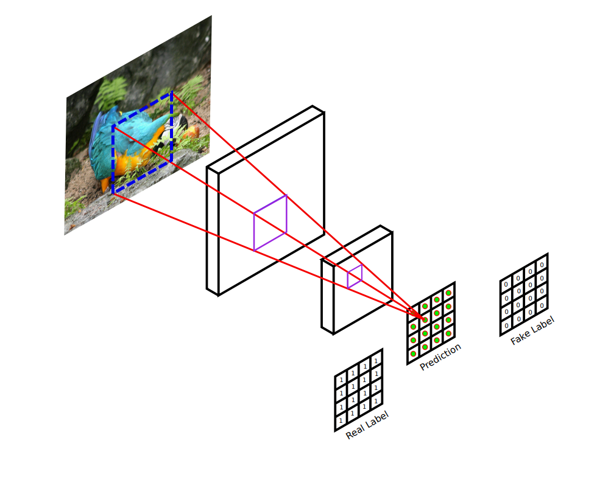

\newpage{}

# Abstract
This report examines the implementation of a Convolutional Neural Network for image exposure correction. A Generative Adversarial Network (GAN) style network architecture  is used and it's loss functions analysed.

# Introduction
Image exposure correction is a typical activity for photographers to adjust the light levels present in their photos. The exposure is set by the quantity of light let in during image capture. Adjustments are often made using image processing software such as adobe lightroom after the images are taken by the photographer. The image processing is a manual process that the photographer must perform for every image that they capture. This report explores whether a Generative Adversarial Network (GAN) could be used in order to generate well exposed images from a given under or over exposed image.

# Network Architecture 

## Overview

To achieve image translation from an image of poor exposure to one of more professionally exposed quality, a Generative Adversarial Network archtitecture was used. A GAN is a type of Convolutional Neural Network architecture with a unique construction. One of the ways in which this implementation varies from others is that the network recieves an initial image and a target image. The aim of the network is to correctly hone its weights to consistently generate images or perform image transforms based on training cycles of those input/target paired images.

The 'generative' part of the GAN's structure is a generator model, whose role is to produce an output image from a given input image. On the other side of the GAN structure is the discriminator model which is trained to determine whether an image is real or fake. Here real can be considered to be straight from the dataset of target images, and fake being anything that has too high a loss value post evaluation. This architecture allows the discriminator to critique the generated images. The criticism is used to influence the generator model which reacts by updating it's weights to attempt to create more lifelike images after every epoch.

## Technical Implementation

To create new images from an input image, the generator takes advantage of a U-net style, encoder-decoder design. U-net is an architecture that effectivly downsamples and then upsamples an image. It is a fully connected, convoultional neural net that takes advantage of stride convolution and max-pooling. It also includes skip connections that make localized image information glabally available in the symmetric model, increasing the predictive ability of the generator [@Gayathri2021]. The downscaling or encoding section attempts to gather context from the input whilst the decoder works to identify areas of interest during its upscaling [@Ali_2022].

In this implementation, an image of size 256x256 is shrunk down to a 1x1 feature map before being blown up again back into original size. This is performed by six layers down and six up which convolve the image. Stride is set at 2 in order to downscale and upscale the image. During downscaling, a leaky relu function is used

For the discriminator, a PatchGAN is used. A PatchGAN is a comparably small array of values that represent whether a corresponding area or patch of an image is real or fake [@DBLP:journals/corr/abs-1803-07422]. This relationship between patch and image can be visalized better in figure 1. By utilising this technique, arbitrarily large images can be processed. Other benefits such as fewer parameters and faster runtime can be realised using this method [@DBLP:journals/corr/IsolaZZE16].

# Input Manipulations

To increase the variety of training data, augmentations were applied to the images. During training, a horizontal flip was applied at a probability of 0.5. Another transformation was the addition of colour jitter at a probability of 0.2 to increase the range of colours the model experiences. To aid in training, a normalisation transform was applied giving every training image a level of blur. The ground truth images however only recieved the same normalised blur but neither the colours nor the orientation augmentations since they are the target for the model to work towards.

# Loss function/s used

# Training and testing process followed

# Model evaluation metric/s used

# Analysis and conclusions

# Description of possible alternative approaches

# References