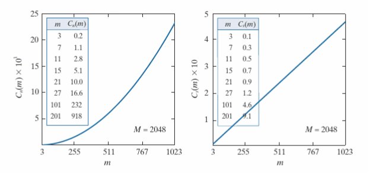

\newpage{}

# Abstract

This technical report seeks to discuss whether, using only video cameras, autonomous driving can be achieved. The implementation of fundamental image processing techniques are later analysed with key findings summarised.

# Literature Review

# Image Processing Implementation
The fundamental functions to perform image processing in the spatial and frequency domain were implemented alongside this report. A Gaussian blur was used as the example kernel.

## Summary and Analysis
Noteable discoveries in computational time, padding types and complexity are summarised below.

### Computational Time of Spatial vs Frequency Domain
During analysis, the frequency domain was found to be significantly faster in computation time. For the same colour image over a range of cutoff frequencies, the frequency domain proved consistently to be 5 times faster on average. This increased efficiency can be seen in greater detail when using images of larger resolutions. The car image in the test notebook is up to 7 times faster in the frequency domain than the spatial domain. The relationship can be explained by the complexity of spacial filtering vs frequency filtering. In a simplified implementation, with image size M by N and kernel size K by L, the spatial domain has complexity O(mnkl) whereas the frequency domain has smaller computational complexity O(mn log(mn) + mn). This can be visualised in the tables below [@Gonzalez2020-zx].

# References